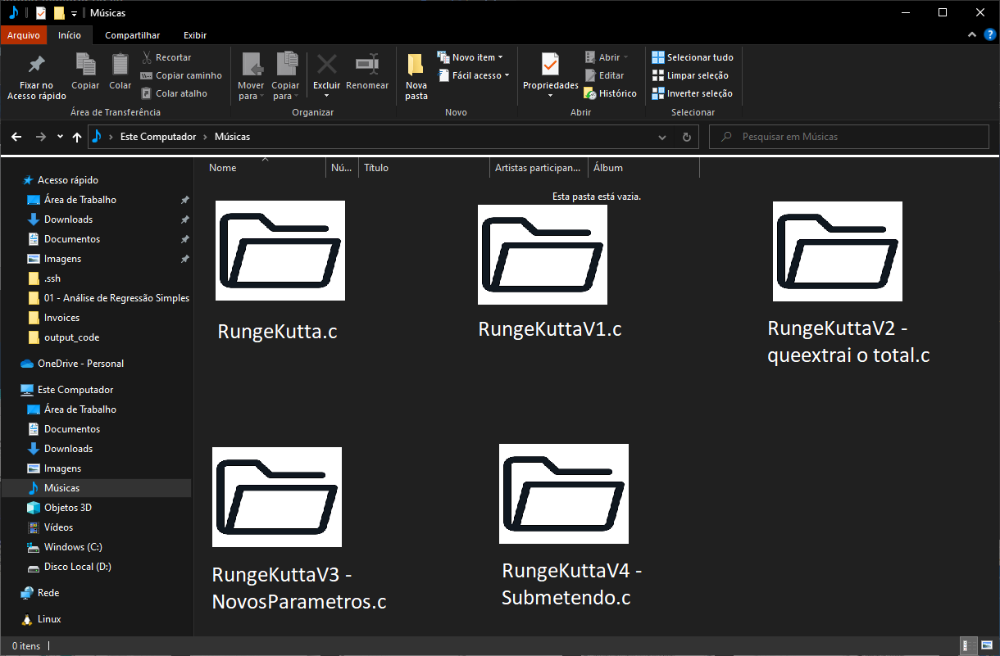
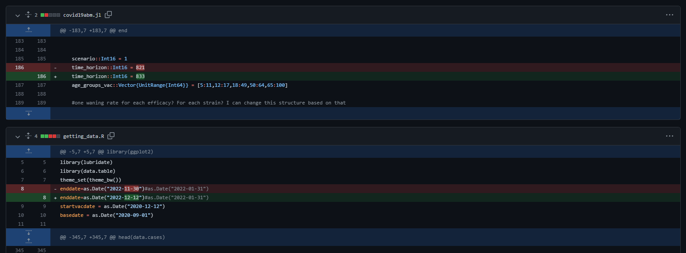

```{r, echo=FALSE, message=FALSE}
library(kableExtra)
library(dplyr)
```


## Objetivos

- *Apresentar ferramentas de trabalho com modelagem.*

- Promover a interação e troca de experiência.

- Promover o senso crítico e novas ideias.


## Git


- Software de **versionamento** de código.


## Git


- Software de **versionamento** de código.


```{r, out.width="60%", fig.align='center', echo=FALSE}


```


## Git


- Software de **versionamento** de código.


```{r, out.width="60%", fig.align='center', echo=FALSE}

knitr::include_graphics("https://micaelpereira.com.br/wp-content/uploads/2018/08/git_glow.png")
```


## Git


- Software de **versionamento** de código.


```{r, out.width="90%", fig.align='center', echo=FALSE}

```

## Gráficos


## Gráficos

```{r, echo=FALSE, message=FALSE}

f <- function(x){
  5.3+2.46*x
}
 
x = runif(35, 0, 20) 
y = f(x)  
r = rnorm(35, mean = 0, sd = 4)
y = y+r

#plot(x, y)

df = data.frame(x, y)

head(df, 5) %>% kableExtra::kbl() %>% kableExtra::kable_styling()

```

## Gráficos

```{r}
modelo = lm(formula = y ~ x)
modelo
```
## Gráficos

```{r, out.height="80%"}
pred.y = predict(modelo, newdata = df)
plot(df$x, df$y)
lines(x, pred.y)
```

## Gráficos

```{r, echo = FALSE, fig.align='center', out.height="50%", out.width="50%"}

library(ggplot2)
df$pred = pred.y

ggplot(df)+
  geom_point(aes(x, y), color = "red", size = 2, stroke = 1.4, shape = 21, fill = NA)+
  geom_line(aes(x, pred), linetype = "dashed", color = "navy", size = 1.7)+
  theme_bw()

```

## Gráficos

```{r, echo = FALSE, fig.align='center', out.height="50%", out.width="50%"}

library(ggplot2)
df$pred = pred.y

ggplot(df)+
  geom_point(aes(x, y, color = "Observed"), size = 2, stroke = 1.4, shape = 21, fill = NA)+
  geom_line(aes(x, pred, color = "Fitted"), linetype = "dashed", size = 1.7)+
  scale_color_manual(values = c("red", "blue"), breaks = c("Observed", "Fitted"))+
  theme_bw()+
  theme(
    axis.title = element_text(size = 20, face = "bold"),
    axis.text = element_text(size = 18, face = "plain"),
    legend.position = c(0.2, 0.85),
    legend.box.background = element_rect(fill = "white", color = "black", size = 1),
    legend.title = element_blank(),
    legend.text = element_text(size = 18)
  )

```

## Gráficos

```{r, echo = FALSE, fig.align='center', out.height="60%"}

y1 = rnorm(10000, 100, 25)
y2 = rnorm(10000, 150, 25)

par(mfrow = c(1,2))
hist(y1)
hist(y2)

```

## Gráficos


```{r, echo = FALSE, fig.align='center', out.height="60%"}

df = data.frame(Weight = c(y1, y2), Sex = c(rep("Female", length(y1)), rep("Male", length(y2))))

ggplot(df)+
  geom_density(aes(x = Weight, color = Sex, fill = Sex), alpha = 0.5, size = 1.3)+
  scale_color_manual(values = c("red", "blue"), breaks = c("Female", "Male"))+
  scale_fill_manual(values = c("red", "blue"), breaks = c("Female", "Male"))+
  theme_bw()+
  theme(
    axis.title = element_text(size = 20, face = "bold"),
    axis.text = element_text(size = 18, face = "plain"),
    legend.position = "right",
    legend.box.background = element_rect(fill = "white", color = "black", size = 1),
    legend.title = element_text(size = 18, face = "bold"),
    legend.text = element_text(size = 18)
  )

```

## Ferramentas

[Watts-Strogatz Network](figs/rede.c)

- R: 

    * `library(igraph)`
    * `sample_smallworld(dim, size, nei, p)`

- Julia:

    * `using Graphs`
    * `watts_strogatz(n, k, β)`


## Assuntos

## Assuntos

- Git e Github.

    * Instalação e inicialização
    * Adicionando arquivos
    * Fazendo mudanças
    * Colaborando

- R

    * ggplot2
    * dplyr
    * Alguns pacotes de análises
    * Rmarkdown
    * Shiny

## Assuntos

- Julia

    * Vantagens
    * Solução de problemas
    * Visualização
    * Pacotes estatísticos


- $\LaTeX$

    * Artigos
    * Beamer
    * Bibitex
    * Uso de software de referências


---